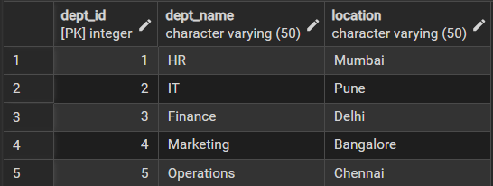
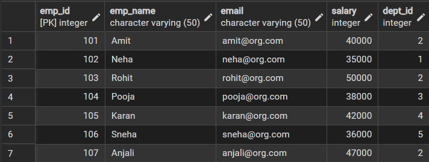
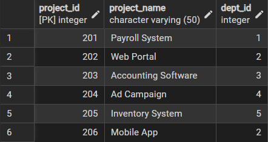
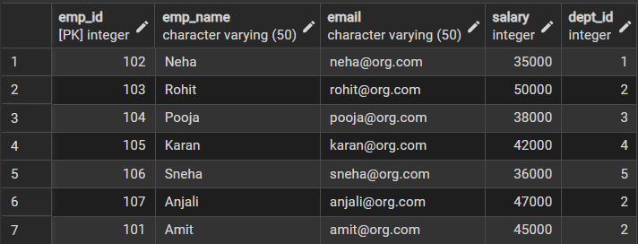
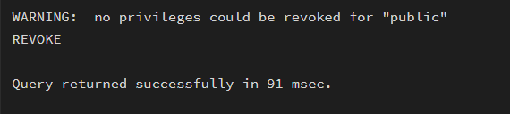
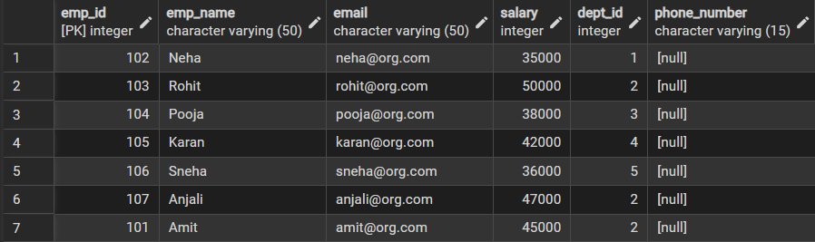
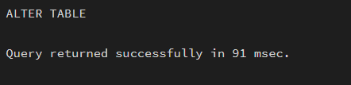
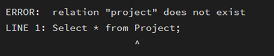

# **Technical training-1 – Worksheet 1**  
## **Design and Implementation of Sample Database System using DDL, DML and DCL**

---

## 👨‍🎓 **Student Details**  
**Name:** Nikhil Kumar  
**UID:** 25MCI10036  
**Branch:** MCA (AI & ML)  
**Semester:** 2nd  
**Section/Group:** 25MAM1(A)  
**Subject:** Technical training -1  
**Date of Performance:** 07/01/2026  

---

## 🎯 **Aim of the Session**  
To design and implement a sample database system using DDL, DML, and DCL commands, including database creation, data manipulation, schema modification, and role-based access control to ensure data integrity and secure, read-only access for authorized users.

---
## 💻 **Software Requirements**

- PostgreSQL (Database Server)  
- pgAdmin
- Windows Operating System  

---
## 📌 **Objectives**  
After completing this practical, the student will be able to:
- Understand the use of DDL commands to create and modify database structures.
- Perform DML operations such as INSERT, UPDATE, DELETE, and SELECT.
- Implement relationships using primary and foreign keys.
- Apply DCL commands to manage roles and privileges.
- Analyze input and output of SQL queries in a real database environment.
  

---

## 🛠️ **Practical / Experiment Steps**  
- Design the database schema for Department, Employee, and Project tables.  
- Create tables using appropriate constraints.  
- Insert sample records into tables.  
- Perform update and delete operations.  
- Retrieve data using SELECT queries.  
- Create a role and grant and revoke privileges.  
- Alter and drop database objects.  


---
# ⚙️ **Procedure of the Experiment:**

##  **Step 1: Start the system and log in to the computer.**  

##  **Step 2: Open PostgreSQL software.**  

##  **Step 3: Create database exp1.**

##  **Step 4: Create tables using DDL commands.**

### **Create table Department**
```sql
CREATE TABLE Department (
    dept_id int PRIMARY KEY,
    dept_name VARCHAR(50) UNIQUE NOT NULL,
    location VARCHAR(50) NOT NULL
);
```

### **Create table Employee**
```sql
CREATE TABLE Employee (
    emp_id int PRIMARY KEY,
    emp_name VARCHAR(50) NOT NULL,
    email VARCHAR(50) UNIQUE NOT NULL,
    salary int CHECK (salary > 0),
    dept_id int,
    CONSTRAINT fk_dept FOREIGN KEY (dept_id)
    REFERENCES Department(dept_id) 
);
```

### **Create table Project**
```sql
CREATE TABLE Project (
    project_id int PRIMARY KEY,
    project_name VARCHAR(50) NOT NULL,
    dept_id int,
    CONSTRAINT fk_project_dept FOREIGN KEY (dept_id)
    REFERENCES Department(dept_id)
);
```
---
##  **Step 5: Insert records using DML commands.** 

### **Insert into Department**
```sql
INSERT INTO Department VALUES (1, 'HR', 'Mumbai');
INSERT INTO Department VALUES (2, 'IT', 'Pune');
INSERT INTO Department VALUES (3, 'Finance', 'Delhi');
INSERT INTO Department VALUES (4, 'Marketing', 'Bangalore');
INSERT INTO Department VALUES (5, 'Operations', 'Chennai');
```


### **Insert into Employee**
```sql
INSERT INTO Employee VALUES (101, 'Amit', 'amit@org.com', 40000, 2);
INSERT INTO Employee VALUES (102, 'Neha', 'neha@org.com', 35000, 1);
INSERT INTO Employee VALUES (103, 'Rohit', 'rohit@org.com', 50000, 2);
INSERT INTO Employee VALUES (104, 'Pooja', 'pooja@org.com', 38000, 3);
INSERT INTO Employee VALUES (105, 'Karan', 'karan@org.com', 42000, 4);
INSERT INTO Employee VALUES (106, 'Sneha', 'sneha@org.com', 36000, 5);
INSERT INTO Employee VALUES (107, 'Anjali', 'anjali@org.com', 47000, 2);
```


### **Insert into Project**
```sql
INSERT INTO Project VALUES (201, 'Payroll System', 1);
INSERT INTO Project VALUES (202, 'Web Portal', 2);
INSERT INTO Project VALUES (203, 'Accounting Software', 3);
INSERT INTO Project VALUES (204, 'Ad Campaign', 4);
INSERT INTO Project VALUES (205, 'Inventory System', 5);
INSERT INTO Project VALUES (206, 'Mobile App', 2);
```


---

## **Step 6: Update and delete records **  
```sql
UPDATE Employee
SET salary = 45000
WHERE emp_id = 101;
```


--- 

```sql
DELETE FROM Project
WHERE project_id = 201;
```


---

## **Step 7: Create Role and Assign Privileges**

### **Create Role**
```sql
CREATE ROLE report_user LOGIN PASSWORD 'report123';
GRANT CONNECT ON DATABASE exp1 TO report_user;
GRANT USAGE ON SCHEMA public TO report_user;
```


### **Grant SELECT Privileges**
```sql
GRANT SELECT ON Department TO report_user;
GRANT SELECT ON Employee TO report_user;
GRANT SELECT ON Project TO report_user;
```

### **Revoke Privilege**
```sql
REVOKE CREATE ON SCHEMA public FROM report_user;
```

---

## **Step 8: Alter and drop table.**

### **Alter table**
```sql
ALTER TABLE Employee
ADD phone_number VARCHAR(15);
```


```sql
ALTER TABLE Employee
ALTER COLUMN emp_name TYPE VARCHAR(100);
```


### **Drop Table**
```sql
drop table Project;
```


---
## 📥📤 I/O Analysis (Input / Output)

### 🔹 Input
- Department, Employee, and Project table creation queries  
- Records inserted into all tables using INSERT commands  
- Update query to modify employee department  
- Delete queries to remove project and employee records  
- Role creation and privilege assignment queries  
- ALTER and DROP table commands  

### 🔹 Output
- Department, Employee, and Project tables created successfully  
- Records inserted, updated, and deleted correctly  
- Referential integrity maintained between tables  
- Data displayed correctly using SELECT queries  
- Role-based access verified using GRANT and REVOKE  
- Table structure modified and Project table dropped successfully  

📸 Screenshots of execution and obtained results are attached.

---

## 📘 **Learning Outcomes**  
- Create database tables using DDL commands with appropriate constraints to ensure data integrity.
- Perform DML operations such as INSERT, UPDATE, and DELETE on database records.
- Establish relationships between tables using PRIMARY KEY and FOREIGN KEY constraints.
- Implement role-based access control using DCL commands to provide secure, read-only access.
- Modify and manage database schemas using ALTER TABLE and DROP TABLE commands.
  

---