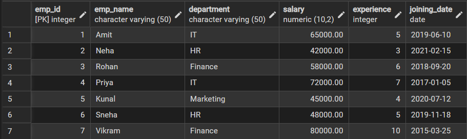
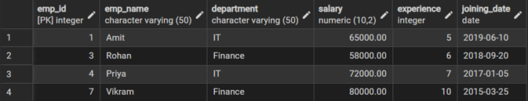
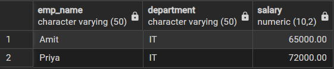
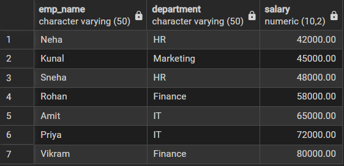
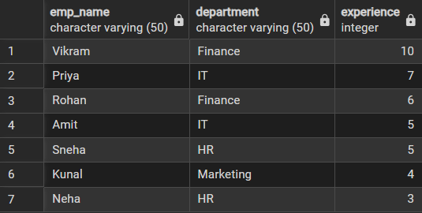
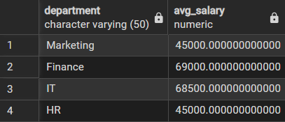
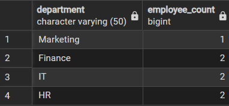
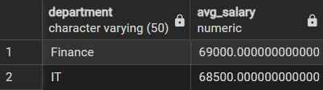
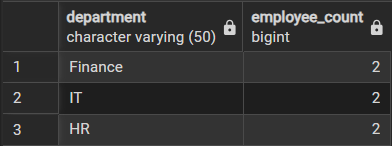
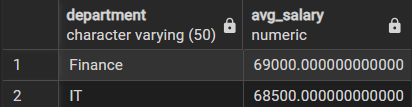

# **Technical training-1 – Worksheet 2**  

---

## 👨‍🎓 **Student Details**  
**Name:** Nikhil Kumar  
**UID:** 25MCI10036  
**Branch:** MCA (AI & ML)  
**Semester:** 2nd  
**Section/Group:** 25MAM1(A)  
**Subject:** Technical training -1  
**Date of Performance:** 13/01/2026  

---

## 🎯 **Aim of the Session**  
To implement and analyze SQL SELECT queries using filtering, sorting, grouping, and aggregation concepts in PostgreSQL for efficient data retrieval and analytical reporting.

---

## 💻 **Software Requirements**
- PostgreSQL (Database Server)  
- pgAdmin
- Windows Operating System  

---

## 📌 **Objectives**  
- To retrieve specific data using filtering conditions
- To sort query results using single and multiple attributes
- To perform aggregation using grouping techniques
- To apply conditions on aggregated data
- To understand real‑world analytical queries commonly asked in placement interviews

---

## 🛠️ **Procedure of the practical**  
- Create a sample table representing Employee details
- Insert realistic records into the table
- Retrieve filtered data using WHERE clause
- Sort query results using ORDER BY clause
- Group records using GROUP BY clause
- Apply conditions on grouped data using HAVING clause
- Analyze execution order of WHERE and HAVING clauses

---

# ⚙️ **Practical/Experiment Steps**
## Step 1: Database and Table Preparation
- Start the PostgreSQL server.
- Open the PostgreSQL client tool.
- Create a database for the experiment.
- Prepare a sample table representing customer orders containing details such as customer name, product, quantity, price, and order date.
- Insert sufficient sample records to allow meaningful analysis.

Purpose: To create a realistic dataset for performing analytical queries.

## Step 2: Filtering Data Using Conditions
- Execute data retrieval operations to display only those records that satisfy specific conditions, such as higher-priced orders.
- Observe how filtering limits the number of rows returned.

Observation: Filtering reduces unnecessary data processing and improves query efficiency.

## Step 3: Sorting Query Results
- Retrieve selected columns from the table and arrange the output based on numerical values such as price.
- Perform sorting using both ascending and descending order.
- Apply sorting on more than one attribute to understand priority-based ordering.

Observation: Sorting is essential for reports, rankings, and ordered displays.

## Step 4: Grouping Data for Aggregation
- Group records based on a common attribute such as product.
- Calculate aggregate values like total sales for each group.
- Analyze how multiple rows are combined into summarized results.

Observation: Grouping transforms transactional data into analytical insights.

## Step 5: Applying Conditions on Aggregated Data
- Apply conditions on grouped results to retrieve only those groups that satisfy specific aggregate criteria.
- Compare the difference between row-level filtering and group-level filtering.

Observation: Conditions applied after grouping allow refined analytical reporting.

## Step 6: Conceptual Understanding of Filtering vs Aggregation Conditions
- Analyze scenarios where conditions are incorrectly applied before grouping.
- Correctly apply conditions after grouping to avoid logical errors.

Observation: Understanding execution order prevents common SQL mistakes frequently tested in interviews.

---

## 📥📤 Input/Output details and screenshots

### 1. Creating sample table and inserting records.
```sql
CREATE TABLE employee_details (
    emp_id SERIAL PRIMARY KEY,
    emp_name VARCHAR(50),
    department VARCHAR(50),
    salary NUMERIC(10,2),
    experience INT,
    joining_date DATE
);

INSERT INTO employee_details (emp_name, department, salary, experience, joining_date) VALUES
('Amit', 'IT', 65000, 5, '2019-06-10'),
('Neha', 'HR', 42000, 3, '2021-02-15'),
('Rohan', 'Finance', 58000, 6, '2018-09-20'),
('Priya', 'IT', 72000, 7, '2017-01-05'),
('Kunal', 'Marketing', 45000, 4, '2020-07-12'),
('Sneha', 'HR', 48000, 5, '2019-11-18'),
('Vikram', 'Finance', 80000, 10, '2015-03-25');
SELECT * FROM employee_details;
```


---

### 2. Filtering data using WHERE clause
```sql
-- Employees with salary greater than 50000
SELECT * 
FROM employee_details
WHERE salary > 50000;
```


---

```sql
-- Employees from IT department
SELECT emp_name, department, salary
FROM employee_details
WHERE department = 'IT';
```


---

### 3. Sorting query results using ORDER BY clause
```sql
-- Sort employees by salary (ascending)
SELECT emp_name, department, salary
FROM employee_details
ORDER BY salary ASC;
```


---

```sql
-- Sort employees by experience (descending)
SELECT emp_name, department, experience
FROM employee_details
ORDER BY experience DESC;
```


---

### 4. Grouping data for aggregation.
```sql
-- Average salary per department
SELECT department, AVG(salary) AS avg_salary
FROM employee_details
GROUP BY department;
```


---

```sql
-- Number of employees in each department
SELECT department, COUNT(emp_id) AS employee_count
FROM employee_details
GROUP BY department;
```


---

### 5. Applying conditions on aggregated data using HAVING clause.
```sql
-- Departments with average salary greater than 50000
SELECT department, AVG(salary) AS avg_salary
FROM employee_details
GROUP BY department
HAVING AVG(salary) > 50000;
```


---

```sql
-- Departments having more than or equal to 2 employees
SELECT department, COUNT(emp_id) AS employee_count
FROM employee_details
GROUP BY department
HAVING COUNT(emp_id) >= 2;
```


---

### 6. Using WHERE and HAVING together
```sql
-- Display departments where:
-- 1. Only employees with more than 4 years of experience are considered (row-level filtering)
-- 2. The average salary of those employees is greater than 60000 (group-level filtering)
SELECT department, AVG(salary) AS avg_salary
FROM employee_details
WHERE experience > 4            -- Filters rows before grouping
GROUP BY department              -- Groups records department-wise
HAVING AVG(salary) > 60000;      -- Filters groups after aggregation
```


---

## 📘 **Learning Outcomes**  
- Students understand how data can be filtered to retrieve only relevant records from a database.
- Students learn how sorting improves readability and usefulness of query results in reports.
- Students gain the ability to group data for analytical purposes.
- Students clearly differentiate between row-level conditions and group-level conditions.
- Students develop confidence in writing analytical SQL queries used in real-world scenarios.
- Students are better prepared to answer SQL-based placement and interview questions related to filtering, grouping, and aggregation.
  
---