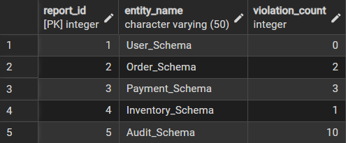
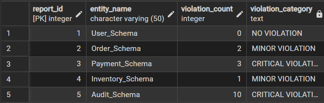
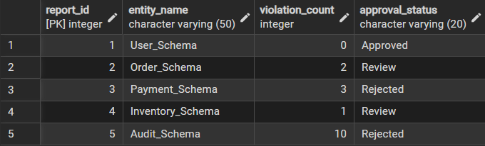
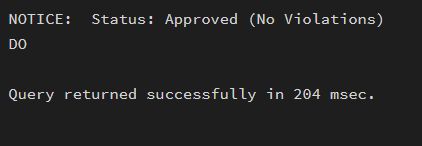
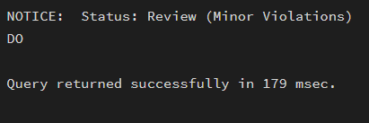
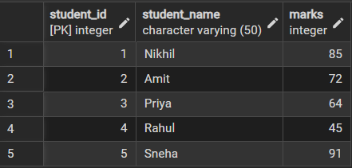
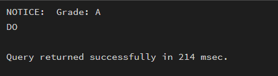
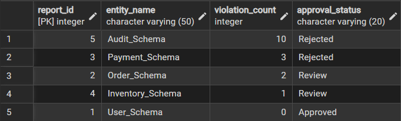

# **Technical training-1 – Worksheet 3**  

---

## 👨‍🎓 **Student Details**  
**Name:** Nikhil Kumar  
**UID:** 25MCI10036  
**Branch:** MCA (AI & ML)  
**Semester:** 2nd  
**Section/Group:** 25MAM1(A)  
**Subject:** Technical training -1  
**Date of Performance:** 27/01/2026  

---

## 🎯 **Aim of the Session**  
To implement conditional decision-making logic in PostgreSQL using IF–ELSE constructs and CASE expressions for classification, validation, and rule-based data processing.

---

## 💻 **Software Requirements**
- PostgreSQL (Database Server)  
- pgAdmin
- Windows Operating System  

---

## 📌 **Objectives**  
- To understand conditional execution in SQL
- To implement decision-making logic using CASE expressions
- To simulate real-world rule validation scenarios
- To classify data based on multiple conditions
- To strengthen SQL logic skills required in interviews and backend systems

---

## 🛠️ **Theory**  
In real-world database systems, data often needs to be validated, categorized, or transformed based on business rules. Conditional logic allows the database to make decisions dynamically instead of relying solely on application-layer logic.
PostgreSQL supports conditional logic mainly through:
- CASE Expressions (used inside SELECT, UPDATE, INSERT)
- IF–ELSE constructs (used inside PL/pgSQL blocks such as functions and procedures)

### CASE Expression
- Evaluates conditions sequentially
- Returns a value based on the first true condition
- Can be used in SELECT, UPDATE, ORDER BY, and WHERE clauses

### Types of CASE
- Simple CASE → compares expressions
- Searched CASE → evaluates boolean conditions

### Conditional logic is heavily used in:
- Data classification (grades, salary slabs)
- Violation detection
- Status mapping
- Business rule enforcement

---

# ⚙️ **Practical/Experiment Steps**

## Prerequisite Understanding
Students should first create a table that stores:
- A unique identifier
- A schema or entity name
- A numeric count representing violations or issues
Populate the table with multiple records having different violation counts.

```sql
CREATE TABLE SCHEMA_ANALYSIS (
report_id INT PRIMARY KEY,
    entity_name VARCHAR(50) NOT NULL,
    violation_count INT NOT NULL
);

INSERT INTO SCHEMA_ANALYSIS VALUES
(1, 'User_Schema', 0),
(2, 'Order_Schema', 2),
(3, 'Payment_Schema', 3),
(4, 'Inventory_Schema', 1),
(5, 'Audit_Schema', 10);

SELECT * FROM SCHEMA_ANALYSIS;
```


---

## Step 1: Classifying Data Using CASE Expression
**Task for Students:**
- Retrieve schema names and their violation counts.
- Use conditional logic to classify each schema into categories such as:
  - No Violation
  - Minor Violation
  - Critical Violation

```sql
SELECT *,
CASE 
    WHEN violation_count = 0 THEN 'NO VIOLATION'
    WHEN violation_count BETWEEN 1 AND 2 THEN 'MINOR VIOLATION'
    ELSE 'CRITICAL VIOLATION'
END AS VIOLATION_CATEGORY
FROM SCHEMA_ANALYSIS;
```


**Learning Focus:**
- Using searched CASE
- Sequential condition checking
- Real-world compliance reporting logic

---

## Step 2: Applying CASE Logic in Data Updates
**Task for Students:**
- Add a new column to store approval status.
- Update this column based on violation count using conditional rules such as:
  - Approved
  - Needs Review
  - Rejected

```sql
ALTER TABLE SCHEMA_ANALYSIS
ADD COLUMN approval_status VARCHAR(20);

UPDATE SCHEMA_ANALYSIS
SET approval_status =
CASE
    WHEN violation_count = 0 THEN 'Approved'
    WHEN violation_count BETWEEN 1 AND 2 THEN 'Review'
    ELSE 'Rejected'
END;

SELECT * FROM SCHEMA_ANALYSIS;
```


**Learning Focus:**
- Automating decisions inside the database
- Reducing application-side logic
- Using CASE inside UPDATE statements

---

## Step 3: Implementing IF–ELSE Logic Using PL/pgSQL
**Task for Students:**
- Use a procedural block instead of a SELECT statement.
- Declare a variable representing violation count.
- Display different messages based on the value of the variable using IF–ELSE logic.

```sql
DO $$
DECLARE
    v_violation_count INT := 0;   -- change value to test
BEGIN
    IF v_violation_count = 0 THEN
        RAISE NOTICE 'Status: Approved (No Violations)';
    ELSIF v_violation_count BETWEEN 1 AND 2 THEN
        RAISE NOTICE 'Status: Review (Minor Violations)';
    ELSE
        RAISE NOTICE 'Status: Rejected (Critical Violations)';
    END IF;
END $$;
```

**For violation_count=0**<br>


**For violation_count=2**<br>


**Learning Focus:**
- Understanding procedural SQL
- ELSE-IF ladder execution
- Backend validation logic in stored procedures

---

## Step 4: Real-World Classification Scenario (Grading System)
**Task for Students:**
- Create a table to store student names and marks.
- Classify students into grades based on their marks using conditional logic.

```sql
CREATE TABLE Student (
    student_id SERIAL PRIMARY KEY,
    student_name VARCHAR(50),
    marks INT CHECK (marks BETWEEN 0 AND 100)
);

INSERT INTO Student (student_name, marks) VALUES
('Nikhil', 85),
('Amit', 72),
('Priya', 64),
('Rahul', 45),
('Sneha', 91);
SELECT * FROM Student;
```


```sql
DO $$
DECLARE
    marks INT := 85;   -- change value to test
BEGIN
    IF marks >= 90 THEN
        RAISE NOTICE 'Grade: A+';
    ELSIF marks >= 80 THEN
        RAISE NOTICE 'Grade: A';
    ELSIF marks >= 70 THEN
        RAISE NOTICE 'Grade: B+';
    ELSIF marks >= 60 THEN
        RAISE NOTICE 'Grade: B';
    ELSIF marks >= 50 THEN
        RAISE NOTICE 'Grade: C';
    ELSE
        RAISE NOTICE 'Fail';
    END IF;
END $$;
```


**Learning Focus:**
- Common interview use case
- Data categorization
- Rule-based evaluation

---

## Step 5: Using CASE for Custom Sorting
**Task for Students:**
- Retrieve schema details.
- Apply conditional priority while sorting records based on violation severity.

```sql
SELECT *
FROM SCHEMA_ANALYSIS
ORDER BY
    CASE
        WHEN violation_count = 0 THEN 3        -- Lowest priority
        WHEN violation_count BETWEEN 1 AND 2 THEN 2
        ELSE 1                                 -- Highest priority
    END,
    violation_count DESC;
```


**Learning Focus:**
- Advanced CASE usage
- Custom ordering logic and Dashboard and reporting scenarios

---

## 📘 **Learning Outcomes**  
This experiment demonstrates how conditional logic is implemented in PostgreSQL using CASE expressions and IF–ELSE constructs.
Students gain strong command over rule-based SQL logic, which is essential for:
- Backend systems
- Analytics
- Compliance reporting
- Placement and technical interviews
  
---