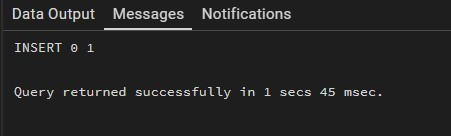
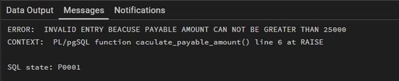
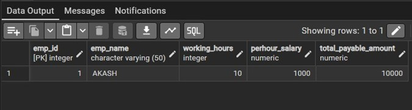

# **Technical training-1 – Worksheet 9**  

---

## 👨‍🎓 **Student Details**  
**Name:** Nikhil Kumar  
**UID:** 25MCI10036  
**Branch:** MCA (AI & ML)  
**Semester:** 2nd  
**Section/Group:** 25MAM1(A)  
**Subject:** Technical training -1  
**Date of Performance:** 07/04/2026  

---

## 🎯 **Aim of the Session**
To implement database triggers in PostgreSQL to automatically calculate values and enforce constraints during data insertion operations.

---

## 💻 **Software Requirements**
- PostgreSQL (Database Server)  
- pgAdmin
- Windows Operating System  

---

## 📌 **Objectives**  
- Trigger Implementation: To understand how to create and use triggers in PostgreSQL.  
- Automation: To automate calculation of total payable amount using triggers.  
- Data Integrity: To enforce constraints using trigger conditions.  
- Real-time Processing: To execute logic automatically before inserting data.

---

## 🛠️ **Theory**  
Triggers are special database objects that automatically execute a function when a specified event (INSERT, UPDATE, DELETE) occurs on a table. In PostgreSQL, triggers are associated with trigger functions written in PL/pgSQL. They help maintain data integrity, enforce business rules, and automate tasks.

---

# ⚙️ **Practical/Experiment Steps**

## Step 0: Creating table query

**Code**
```sql
CREATE TABLE employee (
    emp_id INT PRIMARY KEY,
    emp_name VARCHAR(50),
    working_hours INT,
    perhour_salary NUMERIC,
    total_payable_amount NUMERIC
);
```

---

## Step 1: Creating trigger function query.

**Code**
```sql
CREATE OR REPLACE FUNCTION CACULATE_PAYABLE_AMOUNT() RETURNS TRIGGER
AS
$$
  BEGIN
		NEW.total_payable_amount:=NEW.perhour_salary*New.working_hours;

		IF NEW.total_payable_amount>25000 THEN
		RAISE EXCEPTION 'INVALID ENTRY BEACUSE PAYABLE AMOUNT CAN NOT BE GREATER THAN 25000';
		END IF;

		RETURN NEW;
   END;

$$ LANGUAGE PLPGSQL;
```

---

## Step 2: Creating trigger query.

**Code**
```sql
CREATE OR REPLACE TRIGGER AUTOMATED_PAYABLE_AMOUNT_CALCULATION
BEFORE INSERT
ON  employee
FOR EACH ROW
EXECUTE FUNCTION CACULATE_PAYABLE_AMOUNT()
```

---

## Step 3: Inserting valid data.

**Code**
```sql
INSERT INTO EMPLOYEE (EMP_ID, EMP_NAME, working_hours, perhour_salary)
VALUES (1, 'AKASH', 10, 1000);
```
**Output**
<br>


---

## Step 4: Inserting Invalid data (Exception case).

**Code**
```sql
INSERT INTO EMPLOYEE (EMP_ID, EMP_NAME, working_hours, perhour_salary)
VALUES (2, 'ANKUSH', 8, 100000);
```
**Output**
<br>


---

## Step 5: Retrieving data query.

**Code**
```sql
SELECT * FROM EMPLOYEE;
```
**Output**
<br>


---
## 📘 **Learning Outcomes**
- Students will be able to create and use triggers in PostgreSQL.
- Students will understand how to automate calculations using triggers.  
- Students will enforce constraints using trigger conditions.  
- Students will understand real-time execution of database logic.
---